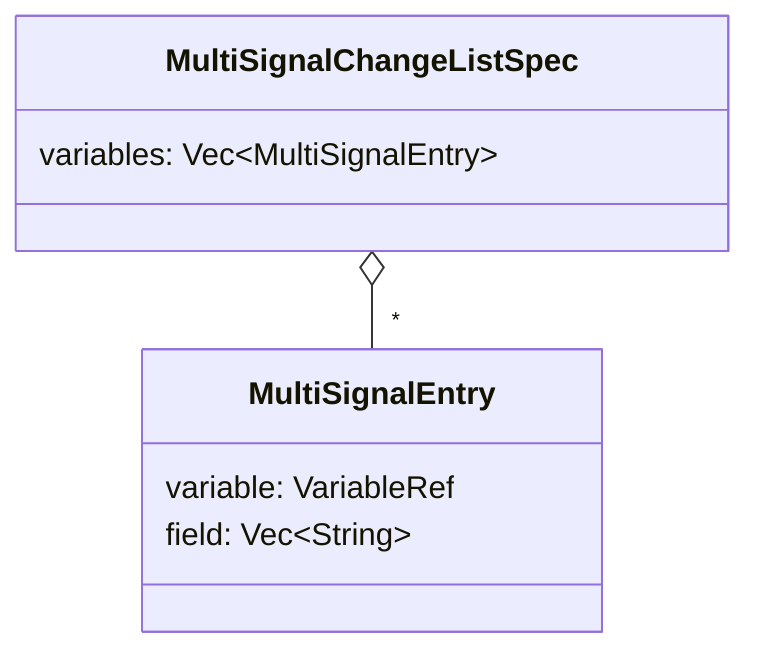
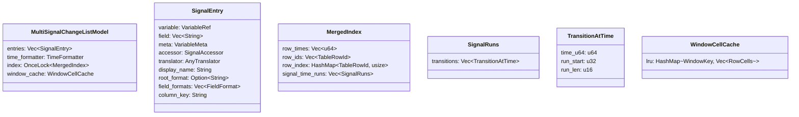
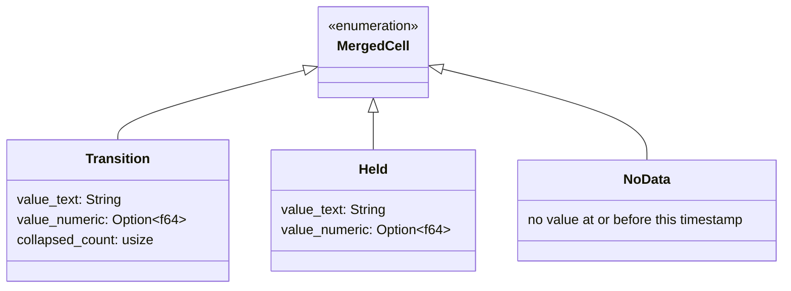

# Multi-Signal Change List — Sparse/On-Demand Requirements & UX Specification

## 1. Feature Overview

The Multi-Signal Change List is a table model for Surfer's tile-based UI that displays a merged timeline of value transitions across multiple selected signals.

This specification mandates one implementation mode only:

- Sparse/index-only core
- On-demand value materialization for visible rows only
- No eager `O(T*S)` full-cell table construction

Where:

- `T` = total unique merged timestamps
- `S` = number of selected signals

The user experience remains unchanged versus the original UX goals:

- merged timeline
- per-signal columns
- held values dimmed
- collapsed same-timestamp transitions as `(+N)`
- row activation sets waveform cursor
- sorting/filtering/searching available

---

## 2. Non-Negotiable Design Constraints

1. Index-only persistent state.
- Persistent model/cache state may contain transition indexes, row-id mappings, and lightweight metadata only.
- Persistent state must not contain per-row-per-signal rendered cell strings.

2. On-demand value rendering.
- Cell text, dimming state, and collapsed indicators are computed only for rows currently needed by viewport rendering, clipboard export, or active operation.

3. Async operations remain async.
- Initial index build runs on background worker.
- Filter/search/sort also run async and operate over index plus on-demand probes.

4. No UX regressions.
- Existing intended UX stays identical (titles, behavior, interactions, indicators).

5. Runtime must not rescan transitions.
- `iter_changes()` is allowed during index build only.
- Rendering/sort/filter/search/copy must use index lookups and time queries, not transition re-iteration.

---

## 3. Data Model

### 3.1 Model Configuration



### 3.2 Runtime Structures (Sparse)



### 3.3 Materialized Cell (Ephemeral)

`MergedCell` is not persisted globally for all rows. It is computed only when needed.



---

## 4. Index Build Algorithm (Async)

### 4.1 Inputs

- `N` selected signals
- each signal exposes iterator of `(time_u64, value)` changes

### 4.2 Outputs (Index Only)

1. Global merged timeline.
- `row_times: Vec<u64>` sorted unique timestamps
- `row_ids: Vec<TableRowId>` (timestamp-derived)
- `row_index: HashMap<TableRowId, usize>`

2. Per-signal compressed runs.
- For each signal, keep ordered unique `time_u64` entries.
- For each unique time, store run metadata:
- where run starts in signal transition stream
- run length at same timestamp
- This preserves collapsed-count semantics without storing every rendered cell.

### 4.3 Complexity

- Build time: `O(total_transitions log T)` for timeline dedup plus per-signal grouping
- Memory: `O(T + total_transitions)` (not `O(T*S)`)

### 4.4 Runtime Lookup Guarantees

For each signal and timestamp, index lookup must provide in `O(log R)`:

- whether there is a transition run exactly at `T`
- transition run length at `T` (for `collapsed_count`)
- previous transition timestamp `< T` if exact run does not exist

Where `R` is per-signal count of unique transition timestamps.

---

## 5. On-Demand Cell Materialization

### 5.1 Authoritative Value Source

Value retrieval at time `T` must use waveform time-query API (`query_variable`) with the signal's canonical `VariableRef`.

Per-row cell state uses both sources:

- transition-exactness and `collapsed_count` from `signal_time_runs`
- actual value at-or-before `T` from `query_variable(variable, T)`

This avoids re-iterating transitions and guarantees consistent held-value semantics.

### 5.2 Visible Viewport Materialization

For each visible row range `[r0, r1)` and each visible signal column:

1. get row timestamp `T = row_times[r]`
2. binary-search signal run index for `T`
3. query value at `T` via `query_variable`
4. derive cell:
- exact run at `T` and value exists => `Transition`
- no exact run and value exists => `Held`
- no value exists => `NoData`
5. if exact run length is `n > 1`, render `collapsed_count = n - 1`

### 5.3 Formatting and Rendering

- Materialized cell is rendered immediately, then eligible for LRU window cache reuse.
- Window cache key includes:
- row-range bucket
- visible column set
- sort/filter revision
- time-format revision
- translator/format revision
- data generation

### 5.4 No Global Cell Table

The implementation must never allocate full `Vec<MergedRow { cells: Vec<MergedCell> }>` over all rows.

---

## 6. Search, Filter, and Sort (Async, Index-Driven)

### 6.1 Filtering/Search

- Filtering/search runs async over candidate row IDs.
- Search text is evaluated lazily from:
- formatted time text for row
- on-demand per-signal value text probes for that row
- Optional short-lived per-task memoization is allowed.
- No permanent full `search_text` vector for all rows.

### 6.2 Sorting

- Time-column sort: direct from `row_times` index.
- Signal-column sort:
- async comparator probes on-demand sort keys (`Numeric` or `Text`) per row
- task-local memoization allowed
- no permanent full-table sort-key storage

### 6.3 Required Table Infrastructure Changes

To support sparse mode without UX compromise:

1. Introduce a lazy search path for this model.
- filtering and type-to-search must be able to request search text on demand for row chunks
- the model must not be forced to prebuild `search_texts: Vec<String>` for all rows

2. Keep table cache lightweight for this model.
- cached output stores row ordering/index only (`row_ids`, `row_index`)
- any search/sort probe data is task-local and dropped after task completion

3. Preserve existing behavior.
- filter UX and type-to-search UX remain functionally identical
- implementation may compute incrementally under the hood

### 6.4 Async Cancellation and Revisioning

All async tasks must be revision-gated.

- Maintain monotonic `table_revision` per tile.
- Every async task captures revision and task kind (`build-index`, `filter`, `sort`, `search`, `materialize-window`).
- Apply result only if `task.revision == current.table_revision`.
- When a new request supersedes old work, increment revision and abandon stale task results.
- Long tasks should check cancellation cooperatively at chunk boundaries.

---

## 7. UX Specification (No Compromise)

### 7.1 Entry Point: Context Menu

- When exactly one variable is selected: show existing `Signal change list`.
- When two or more variables are selected: show `Multi-signal change list`.
- Non-variable selected items are ignored.

### 7.2 Table Layout

- Fixed `Time` column.
- One dynamic column per selected signal.
- Same title behavior and truncation behavior as prior spec.

### 7.3 Visual Semantics

- `Transition`: normal text
- `Held`: dimmed/muted text
- `NoData`: `"—"` dimmed
- Collapsed same-time transitions: `"<value> (+N)"`

### 7.4 Interactions

- Click row: set waveform cursor to row timestamp.
- Sorting/filtering/copy/column visibility unchanged.
- Drill-down action from signal column to single-signal change list remains available.

---

## 8. Cache and Invalidation Model

### 8.1 Separate Revisions/Generations

Maintain independent counters for:

- waveform data generation
- time formatting revision
- translator/field-format revision for included signals
- table view revision (sort/filter/column changes)

### 8.2 Rebuild Rules

1. Rebuild merged index when waveform generation changes or signal membership changes.
2. Do not rebuild merged index for pure time-format change.
3. Invalidate window materialization cache when time format or translator/field format changes.
4. Recompute row ordering for sort/filter changes.
5. Invalidate/ignore stale async tasks via revision checks.

### 8.3 Snapshot Policy

- Signal membership is snapshot-at-creation.
- Formatting and translator changes still reflect in display by invalidating on-demand materialization caches.

---

## 9. Row Identity

- One row per unique merged timestamp.
- `TableRowId = TableRowId(time_u64)` is valid because merged timeline deduplicates timestamps.

---

## 10. Serialization

`TableModelSpec` extension:

```rust
TableModelSpec::MultiSignalChangeList {
    variables: Vec<MultiSignalEntry>,
}

MultiSignalEntry {
    variable: VariableRef,
    field: Vec<String>,
}
```

Only spec/config serialize. Runtime indexes/caches are rebuilt lazily.

---

## 11. TableModel Contract

### 11.1 `schema()` and Stable Column Keys

- `time` column key remains fixed.
- Signal column key must be deterministic and identity-based, not positional.
- Required key format:

```text
sig:v1:<escaped-full-variable-path>#<escaped-field-path>
```

Rules:

- `escaped-*` uses a reversible escaping (percent-encoding or equivalent)
- empty field path is encoded as empty right side after `#`
- same signal identity must always produce the same key across sessions

### 11.2 `row_count()` / `row_id_at()`

- backed by filtered/sorted row index list

### 11.3 `materialize_window(...)` (Required Batch Contract)

Implementation must expose a batch materialization path used by renderer and async tasks.

```rust
materialize_window(
    row_ids: &[TableRowId],
    visible_cols: &[usize],
    purpose: MaterializePurpose,
) -> MaterializedWindow
```

`MaterializePurpose` includes at least:

- `Render`
- `SortProbe { col: usize }`
- `SearchProbe`
- `Clipboard`

Requirements:

- perform grouped lookups/translations for the requested window
- use task-local memoization where helpful
- do not allocate global all-row cell storage

### 11.4 `cell(row, col)`

- compatibility method only
- delegates to one-row/one-col materialization path

### 11.5 `sort_key(row, col)`

- on-demand probe; may memoize within active sort task

### 11.6 `search_text(row)`

- on-demand probe; may memoize within active search/filter/type-search task

### 11.7 `on_activate(row)`

- `TableAction::CursorSet(row_time_bigint)`

---

## 12. Performance Targets

1. Open table with 10 signals × 100K transitions each without allocating full cell matrix.
2. Peak memory scales with `O(T + total_transitions + viewport_window)`.
3. Scrolling materializes only newly visible windows.
4. Sorting/filtering remain async and cancel-safe when new requests supersede old ones.
5. No memory growth from retained search/sort temporary data after async task completion.

---

## 13. Edge Cases

- Missing/unloaded signal at build time: skip with warning; fail only if no valid signals remain.
- Duplicate selected signal: deduplicate by `(VariableRef, field)`.
- Signal first transition after current row time: `NoData`.
- Multiple transitions at same timestamp: render last value with `(+N)`.
- Extremely large merged timeline: still bounded by index-only memory model.
- Stale async completion after user changed filter/sort: result ignored by revision mismatch.

---

## 14. Testing Strategy (Automated Only)

### 14.1 Unit Tests

- merged timeline index correctness
- per-signal run grouping correctness
- on-demand materialization: `Transition/Held/NoData`
- value-source correctness vs `query_variable` at exact/held timestamps
- collapsed count correctness for same-time runs
- stable column key determinism and reversibility
- cache/revision invalidation matrix (wave/time-format/translator/view changes)

### 14.2 Integration Tests

- end-to-end `AddTableTile` -> async build -> render rows
- async sort/filter correctness with on-demand probes
- type-search correctness with lazy search provider
- stale async task drop via revision mismatch
- cursor navigation on row activation
- RON round-trip for `MultiSignalChangeList` spec

### 14.3 Snapshot Tests

- held-value dimming
- `(+N)` collapsed marker
- large table scrolling visual correctness

---

## 15. Out of Scope

- inline expansion of collapsed transitions
- auto-refresh signal membership
- CSV export
- advanced trigger-based row filtering
