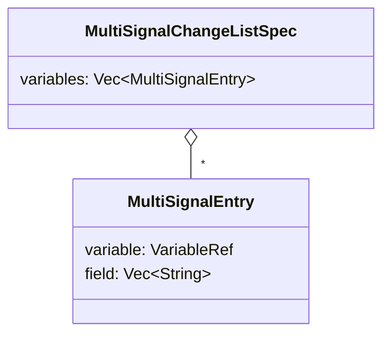
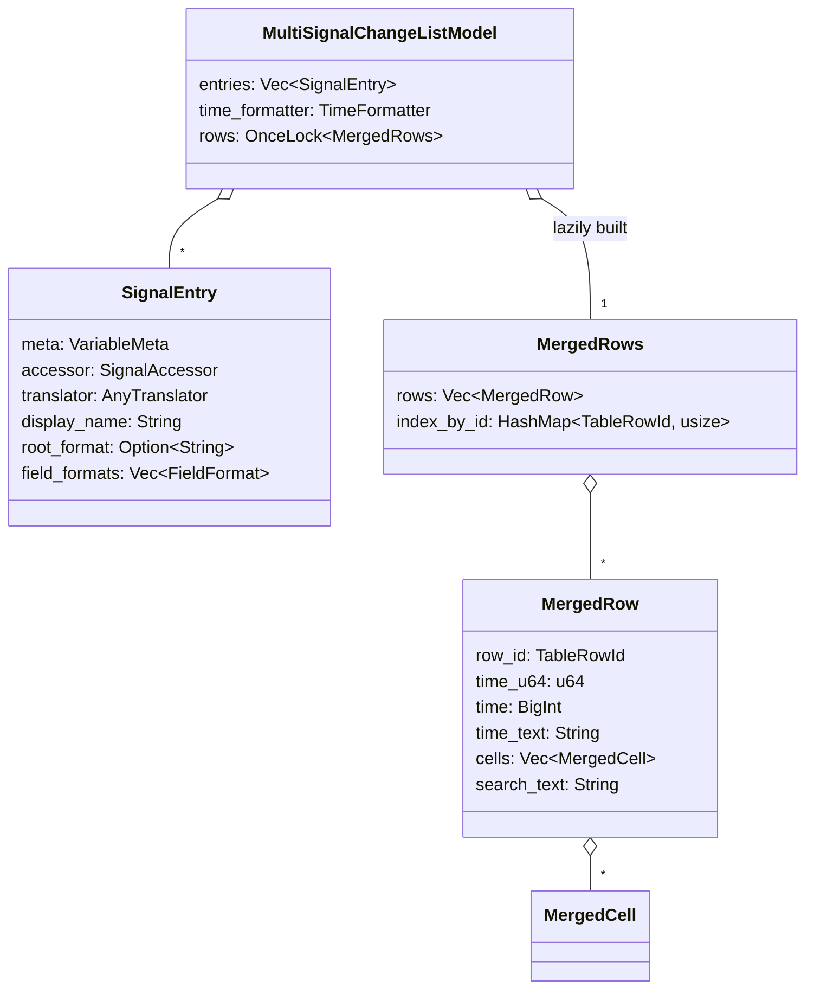
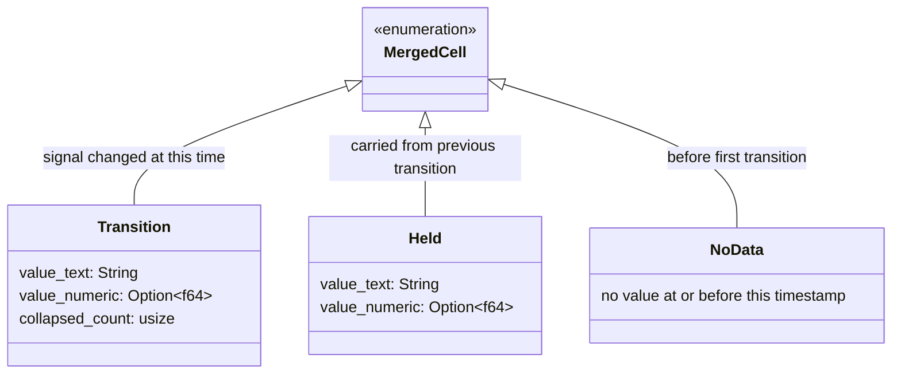
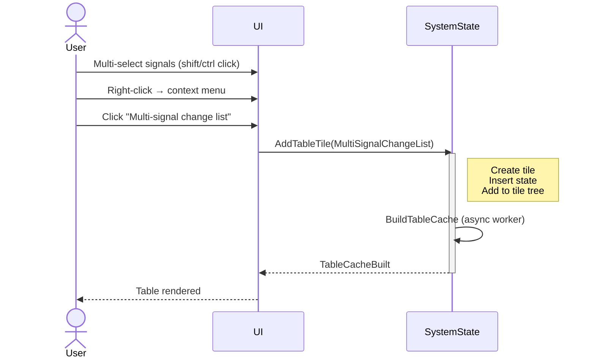

# Multi-Signal Change List — Requirements & UX Specification

## 1. Feature Overview

The Multi-Signal Change List is a new table model for Surfer's tile-based UI that displays a merged timeline of value transitions across multiple selected signals. Each row represents a timestamp where at least one signal changes, with all signals' values shown side by side. This enables cross-signal analysis of timing relationships, protocol handshakes, and state machine transitions.

### Core Capabilities

- **Merged timeline**: Combines transitions from all selected signals into a unified, time-ordered row set
- **Per-signal value columns**: One column per signal showing its value at each timestamp
- **Held-value display**: Signals that do not transition at a given timestamp show their most recent value (dimmed to distinguish from actual transitions)
- **Multi-value indication**: When a signal has multiple transitions at the same timestamp, the last value is shown with a visual indicator that earlier transitions were collapsed
- **Cursor navigation**: Activating a row sets the waveform cursor to that timestamp
- **Async computation**: Row building runs on a background worker thread
- **Persistent configuration**: Model spec serialized in `.surf.ron` state files via `TableModelSpec`

---

## 2. Data Model

### 2.1 Model Configuration



### 2.2 Internal Data Structures



### 2.3 Merged Cell States

Each cell in a row corresponds to one signal and is in one of three states:



| Cell State | Meaning | Display |
|------------|---------|---------|
| **Transition** | Signal changed at this exact time | Normal text |
| **Transition (collapsed)** | Signal changed multiple times at this time; showing last value | Normal text + collapse indicator |
| **Held** | Signal did not change; value carried from previous transition | Dimmed text |
| **NoData** | No value available at this timestamp | `"—"` |

### 2.4 Multi-Value Collapsing

When a single signal has multiple transitions at the same timestamp `T`:

1. All transitions at `T` are collected in order
2. Only the **last** value is stored in the cell
3. The `collapsed_count` field records how many earlier transitions were folded (count = total transitions - 1)
4. The display shows the last value with a superscript or suffix indicator (e.g., `"0xFF (+2)"` meaning two earlier transitions were hidden)

This gives the user a correct final-state view while signaling that intermediate transitions exist. The user can open a single-signal change list for the specific signal to see all individual transitions.

---

## 3. User Experience

### 3.1 Entry Point: Context Menu

The multi-signal change list is initiated from the same context menu used for single-signal change lists, when multiple signals are selected.

```
┌─────────────────────────────────┐
│  Format                      >  │
│  Color                       >  │
│  ─────────────────────────────  │
│  Signal change list             │  ← Single signal (1 selected)
│  Multi-signal change list       │  ← Multiple signals (2+ selected)
│  Analyze selected signals...    │
│  ─────────────────────────────  │
│  Copy value                     │
│  ...                            │
└─────────────────────────────────┘
```

**Visibility rules**:
- **"Signal change list"**: Shown when exactly one `DisplayedVariable` is selected (existing behavior)
- **"Multi-signal change list"**: Shown when two or more `DisplayedVariable` items are among the selected items
- Non-variable items (dividers, markers, streams, groups) in the selection are silently ignored
- If after filtering out non-variables fewer than two signals remain, the menu item is hidden

### 3.2 Result Table Tile

The result appears as a standard table tile with full table features.

#### Column Layout

```
┌──────────┬─────────────────┬─────────────────┬─────────────────┐
│   Time   │   top.clk       │   top.data      │   top.valid     │
├──────────┼─────────────────┼─────────────────┼─────────────────┤
│  100 ns  │   1             │   0xFF (+2)     │   1             │
│  150 ns  │   0             │   0xFF          │   1             │
│  200 ns  │   1             │   0xAB          │   0             │
│  250 ns  │   0             │   0xAB          │   0             │
│  300 ns  │   1             │   0x42          │   1             │
└──────────┴─────────────────┴─────────────────┴─────────────────┘
```

**Fixed column**:
- `Time` — timestamp of the transition event (formatted per user time settings)

**Dynamic columns** (one per selected signal):
- Column header: signal display name (e.g., `top.data` or `top.data.field_name` for struct fields)
- Cell content: formatted signal value at that timestamp

#### Visual Indicators

- **Transition cells**: Rendered in normal text color — the signal changed at this row's timestamp
- **Held-value cells**: Rendered in dimmed/muted text color — the signal did not change; value is carried forward from the most recent transition
- **Collapsed transitions**: Shown as `"<value> (+N)"` where N is the number of hidden earlier transitions at this timestamp
- **No data**: Shown as `"—"` in muted text

#### Table Title

Format: `"Change list: <signal1>, <signal2>, ... (<count> signals)"`

If the combined name is too long (over 60 characters), truncate:
`"Change list: <signal1>, <signal2>, ... (+N more)"`

Example: `"Change list: top.clk, top.data, top.valid (3 signals)"`

#### Standard Table Features

All standard table tile features apply:

- **Sorting**: Click column headers to sort by time or any signal's values
- **Filtering**: Use the filter bar to search across all cell values
- **Column visibility**: Toggle signal columns on/off via column menu
- **Copy**: Select rows and copy as TSV to clipboard
- **Row activation**: Clicking a row moves the waveform cursor to that timestamp
- **Selection mode**: Single-select with activate-on-select (clicking navigates the waveform)

### 3.3 Interaction Patterns

**Cross-signal timing analysis workflow**:
1. Select multiple signals of interest in the waveform (shift-click or ctrl-click)
2. Right-click → "Multi-signal change list"
3. Table shows merged timeline — scan for patterns, protocol sequences, glitches
4. Click a row to jump the waveform cursor to that timestamp
5. Use column sorting to find value extremes or groupings
6. Use filter to search for specific values across all signals

**Drill-down to single signal**:
When a collapsed indicator (e.g., `"+2"`) signals hidden transitions, the user can right-click the signal's column header and select "Open signal change list" to see the full transition history for that individual signal.

---

## 4. Merge Algorithm

### 4.1 Timeline Construction

```
Input: N signals with their transition iterators
Output: sorted Vec<MergedRow> with unified timestamps

1. Collect all unique transition timestamps from all signals:
   all_times: BTreeSet<u64> = ∅
   For each signal s in signals:
       For each (time, _value) in s.accessor.iter_changes():
           all_times.insert(time)

2. For each timestamp T in all_times (ascending order):
   Create MergedRow with time = T
   For each signal s at column index i:
       transitions_at_T = collect all of s's transitions at time T
       match transitions_at_T.len():
           0 → cells[i] = Held { last known value of s before T }
                          or NoData if s has no transitions ≤ T
           1 → cells[i] = Transition { value = transitions_at_T[0] }
           n → cells[i] = Transition {
                   value = transitions_at_T[n-1],    // last value
                   collapsed_count = n - 1
               }
   Build search_text from time_text + all cell value texts
```

### 4.2 Held-Value Tracking

For each signal, maintain a running "last known value" as the algorithm iterates through timestamps:

```
For each signal s:
    last_value[s] = None

For each timestamp T in ascending order:
    For each signal s:
        if s has transitions at T:
            process transitions → Transition cell
            last_value[s] = final value at T
        else:
            if last_value[s] is Some(v):
                cells[s] = Held { value = v }
            else:
                cells[s] = NoData
```

### 4.3 Row ID Assignment

```
For each timestamp T:
    row_id = TableRowId(T as u64)
    // Timestamps are unique in the merged set (BTreeSet deduplication)
    // No hash-based disambiguation needed (unlike single-signal model
    // which must handle multiple transitions at same time as separate rows)
```

Since the merge algorithm collapses all transitions at the same timestamp into a single row, each row has a naturally unique timestamp-based ID.

### 4.4 Performance Considerations

- **Time complexity**: O(T * S) where T = total unique timestamps, S = number of signals. Each cell lookup is O(1) with pre-indexed transition data.
- **Memory**: O(T * S) for the merged row table. For 10 signals with 100K transitions each, worst case ~1M cells. Each cell is a small enum (~40 bytes), so ~40 MB — acceptable.
- **Large signal counts**: The table is practical for up to ~20-30 signals. Beyond that, column width makes the table less useful. No artificial limit is imposed.
- **Lazy construction**: Rows are built on first access via `OnceLock`, same pattern as single-signal change list.
- **Async worker**: Row building runs on background thread via `BuildTableCache` message. UI remains responsive with loading spinner.

---

## 5. Serialization & State Persistence

### 5.1 TableModelSpec Extension

Add a new variant to `TableModelSpec`:

```
TableModelSpec::MultiSignalChangeList {
    variables: Vec<MultiSignalEntry>,
}

MultiSignalEntry {
    variable: VariableRef,
    field: Vec<String>,
}
```

Both `MultiSignalEntry` and the spec variant derive `Serialize` and `Deserialize` for RON state file persistence.

### 5.2 Default View Configuration

```rust
config.title = format!("Change list: {} ({} signals)", signal_names_summary, count);
config.sort = vec![TableSortSpec {
    key: TableColumnKey::Str("time"),
    direction: TableSortDirection::Ascending,
}];
config.selection_mode = TableSelectionMode::Single;
config.activate_on_select = true;
```

### 5.3 Cache Invalidation

The table cache is rebuilt when:
- Waveform data is reloaded (cache generation changes)
- Time format changes (time column formatting)
- Translator changes for any included signal
- User explicitly triggers rebuild

---

## 6. Message Flow

### 6.1 New Message Variant

```
Message::AddTableTile {
    spec: TableModelSpec::MultiSignalChangeList {
        variables: Vec<MultiSignalEntry>,
    }
}
```

No new message variants are needed — the existing `AddTableTile` message handles all table creation uniformly.

### 6.2 Interaction Sequence



---

## 7. TableModel Trait Implementation

### 7.1 Schema

```
schema() → TableSchema {
    columns: [
        TableColumn { key: "time",      label: "Time",           width: 120 },
        TableColumn { key: "sig_0",     label: "<signal_0_name>", width: 150 },
        TableColumn { key: "sig_1",     label: "<signal_1_name>", width: 150 },
        ...
        TableColumn { key: "sig_N-1",   label: "<signal_N-1_name>", width: 150 },
    ]
}
```

Column keys use positional indices (`sig_0`, `sig_1`, ...) to avoid ambiguity with signal names that might contain special characters.

### 7.2 Cell Rendering

```
cell(row_id, col) → TableCell:
    col 0 (Time):  TableCell::String(time_text)
    col i (Signal): match cells[i-1]:
        Transition { value_text, collapsed_count: 0 } →
            TableCell::String(value_text)
        Transition { value_text, collapsed_count: n } →
            TableCell::String(format!("{value_text} (+{n})"))
        Held { value_text } →
            TableCell::Dimmed(value_text)
        NoData →
            TableCell::Dimmed("—")
```

Note: `TableCell::Dimmed` is a new variant that signals the table renderer to use muted text color. If adding a new variant is undesirable, an alternative is to use `TableCell::String` with a special prefix/metadata that the renderer interprets.

### 7.3 Sort Keys

```
sort_key(row_id, col) → TableSortKey:
    col 0 (Time):   Numeric(time_u64 as f64)
    col i (Signal):
        if cell has value_numeric: Numeric(value_numeric)
        else:                      Text(value_text)
```

Held values sort the same as transition values — the sort key is the value itself regardless of whether it was a transition or held.

### 7.4 Search Text

```
search_text(row_id) → String:
    "{time_text} {value_text_0} {value_text_1} ... {value_text_N}"
```

All cell values are included in search text, allowing the user to filter for any signal's value.

### 7.5 Row Activation

```
on_activate(row_id) → TableAction:
    TableAction::CursorSet(row.time.clone())
```

Same behavior as single-signal change list: clicking a row navigates the waveform cursor to that timestamp.

---

## 8. Edge Cases & Validation

### 8.1 Construction Errors

| Condition | Behavior |
|-----------|----------|
| No wave data loaded | `TableCacheError::DataUnavailable` |
| A signal in the list is not found | Skip that signal; include remaining signals. If all signals are missing, return `TableCacheError::ModelNotFound` |
| A signal is not loaded | Skip that signal with warning; load is not triggered from model. Preflight loading happens before cache build |
| Only one signal after filtering | Still creates a multi-signal table (functionally equivalent to single-signal but with held-value semantics) |
| Duplicate signals in selection | Deduplicate by (VariableRef, field) before creating spec |
| Signal with struct fields | Field path determines which sub-field is displayed; column label includes field path |

### 8.2 Runtime Edge Cases

| Condition | Behavior |
|-----------|----------|
| All signals have zero transitions | Table shows zero rows |
| Signal has transitions only outside visible range | Held values shown from nearest prior transition; or NoData if none |
| Very large number of merged timestamps | Async worker handles computation; table virtualizes rendering (only visible rows drawn) |
| Signal added/removed from waveform after table creation | Table is a snapshot — does not auto-update. User can close and re-create |
| Same timestamp across signals | Single merged row with all signals showing their respective values |
| Signals with different time domains | All signals queried against the same timeline; held values fill gaps naturally |

### 8.3 Display Edge Cases

| Condition | Display |
|-----------|---------|
| Collapsed count = 0 | `"0xFF"` (normal, no indicator) |
| Collapsed count = 1 | `"0xFF (+1)"` |
| Collapsed count = 5 | `"0xFF (+5)"` |
| Held value | `"0xFF"` in dimmed text |
| No data | `"—"` in dimmed text |
| Very long signal name in header | Column header truncated with ellipsis; tooltip shows full name |

---

## 9. Testing Strategy

All functionality must be verifiable through automated tests.

### 9.1 Unit Tests (table/sources/multi_signal_change_list.rs)

- **Basic merge**: Two signals with known transitions verify correct merged row count and cell values
- **Held-value propagation**: Signal A changes at T=100, signal B at T=200 — verify B shows NoData at T=100 (if no prior value) and A shows Held at T=200
- **Multi-value collapsing**: Signal with 3 transitions at same timestamp — verify last value shown with collapsed_count=2
- **NoData cells**: Signal with first transition at T=500 — verify NoData in all rows before T=500
- **Column schema**: Verify schema produces correct column count and labels for N signals
- **Sort keys**: Verify numeric sort for time column, value-dependent sort for signal columns
- **Search text**: Verify all cell values included in search text
- **Row activation**: Verify on_activate returns CursorSet with correct timestamp
- **TableModel trait compliance**: All trait methods return valid data for all rows

### 9.2 Integration Tests

- **Round-trip serialization**: `MultiSignalChangeList` spec survives RON serialize/deserialize
- **Cache build flow**: End-to-end `BuildTableCache` → `TableCacheBuilt` with multi-signal spec
- **Deduplication**: Selecting same signal twice produces single column
- **Missing signal handling**: One of three signals missing — verify table creates with remaining two
- **Context menu visibility**: Verify menu item shown only with 2+ selected variables
- **Row activation navigates cursor**: Clicking row sets waveform cursor to correct time

### 9.3 Snapshot Tests

- **Table rendering**: Visual snapshot of a populated multi-signal change list table
- **Dimmed held values**: Visual snapshot confirming held-value cells appear visually distinct
- **Collapsed indicators**: Visual snapshot showing `"(+N)"` indicators

---

## 10. Future Extensions (Out of Scope)

The following are explicitly out of scope for the initial implementation but inform the design:

- **Column reordering**: Drag-and-drop to reorder signal columns
- **Value-change highlighting**: Flash or highlight cells that just transitioned when scrolling through time
- **Expand collapsed transitions**: Click `"(+N)"` to expand inline and show all transitions at that timestamp
- **Filter by transition-only**: Toggle to hide rows where a specific signal did not transition (show only that signal's actual changes)
- **Cross-signal trigger filtering**: Show only rows where a specific signal meets a condition (e.g., `clk == 1`)
- **Auto-refresh**: React to waveform reload or signal list changes
- **Export to CSV**: Direct file export of the merged table
