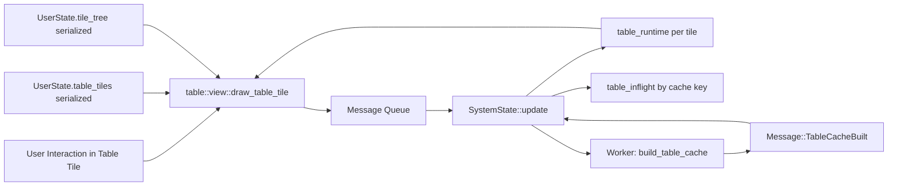
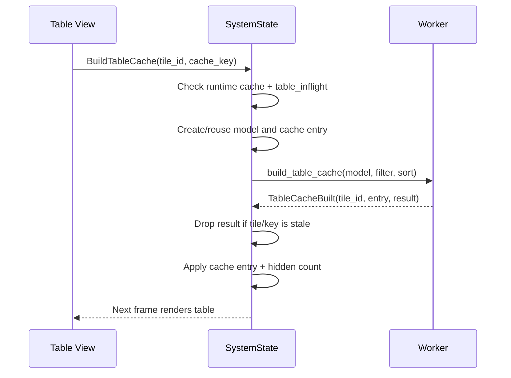
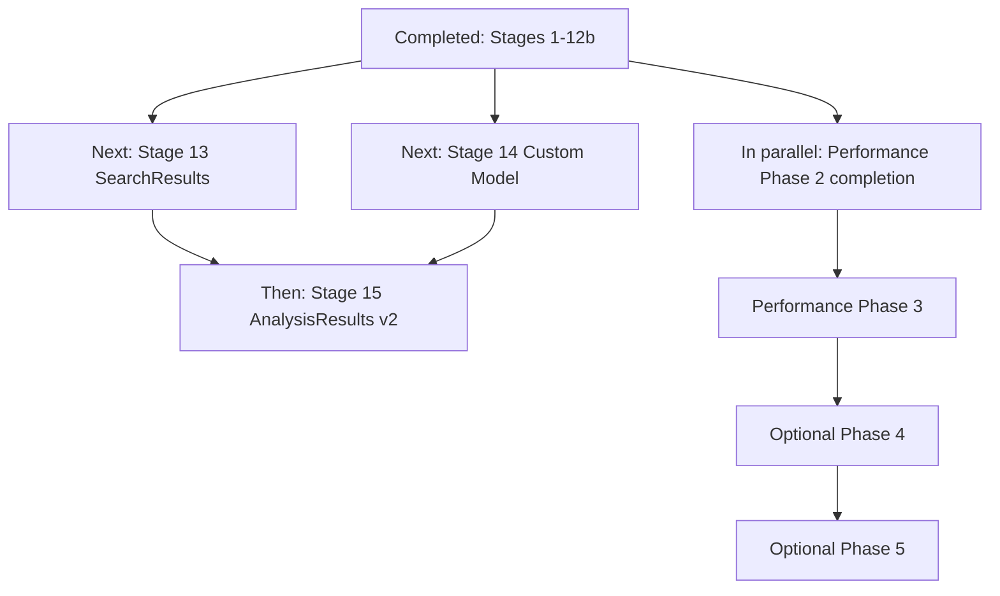

# Table Tile Architecture Specification

## Purpose
This document defines the architecture of Surfer's table tile subsystem. It replaces the earlier design draft with an implementation-grounded specification and integrates the revised performance architecture decisions.

The audience is an engineer implementing or extending table features. After reading this document, an implementer should understand:
- What exists today.
- What is required behavior.
- Where current architecture is intentionally incomplete.
- How to implement the next stages without violating performance and correctness constraints.

## Scope
This specification covers:
- Table tile architecture in `libsurfer/src/table/*`.
- Integration in the central update loop (`libsurfer/src/lib.rs`).
- Tile tree integration (`libsurfer/src/tiles.rs`).
- User entry points (menus, transactions sidebar, command parser, shortcuts).
- Current testing strategy and future staged plans.

This specification does not define:
- New renderer primitives outside existing egui/egui_extras table capabilities.
- Non-table waveform rendering internals.

## User Stories
- Signal change list: show `<time, value>` transitions for a signal, and activating a row moves cursor/time focus.
- FTR transaction trace: show one transaction per row with timing/type/attribute columns; activating a row focuses that transaction and moves cursor.
- Signal search results: show one row per source-level match with jump-to-time behavior.
- Signal analysis results: show derived metrics (for example spikes, idle windows, glitches) in table form.
- Virtual data model: generate deterministic synthetic rows/columns for development, benchmarking, and snapshots.
- Future sources: support additional derived table views over waveform/transaction data.

## Requirements
### Functional Requirements
- Table must be a first-class tile pane in the existing tile tree.
- Table tile state must persist in state files as model specification plus view configuration only.
- Runtime cache and runtime interaction state must never be serialized.
- Table rendering must support virtualization and avoid full-list drawing.
- Sorting must support single and multi-column stable ordering.
- Filtering must support Contains, Exact, Regex, and Fuzzy modes.
- Selection must be keyed by stable row identity, not by display index.
- Selection must survive sort/filter changes and support hidden-selection accounting.
- Activation must be model-driven via table actions.
- Cache build must be asynchronous and stale-safe.
- In-flight cache requests must be deduplicated for identical cache keys.
- Table actions must flow through existing message/update architecture.
- Table tiles must be removable with runtime cleanup.
- Column identity must be key-based, not index-based.
- Table data must be derived from `WaveData` or `TransactionContainer`; table models must not mutate source data.
- Table models must be safe for cross-thread cache building (`Send + Sync` and immutable/read-only semantics).
- Time/value formatting must match Surfer formatting and translation behavior.
- Table interactions must remain keyboard-accessible and compatible with egui/accesskit pathways.
- Scroll behavior must remain predictable after sort, filter, and activation operations.
- Runtime cache/model state must not be captured in undo/redo or serialized state snapshots.
- Table subsystem must degrade safely for missing data, invalid regex, and unavailable models.

### Non-Functional Requirements
- No steady-state per-frame O(n) work on UI thread for large tables.
- No per-frame model reconstruction.
- Async stale results must be dropped deterministically.
- Invalidations must be explicit and testable.
- All behavior changes must be automatically testable (manual-only validation is not acceptable).

## Architecture Overview

## Runtime Layers
### Layer 1: Persistent Tile Configuration
Owned by `UserState`.
- `table_tiles: HashMap<TableTileId, TableTileState>`.
- `TableTileState` contains `TableModelSpec` and `TableViewConfig`.
- Serialized in `.surf.ron` state files.

### Layer 2: Runtime Table State
Owned by `SystemState`.
- `table_runtime: HashMap<TableTileId, TableRuntimeState>`.
- `table_inflight: HashMap<TableCacheKey, Arc<TableCacheEntry>>`.
- Not serialized.

### Layer 3: Model + Cache
Implemented in `libsurfer/src/table/`.
- Model contract: `TableModel` trait.
- Cache build: `build_table_cache`.
- View/controller: `view.rs`.
- Source models: `sources/`.

## Core Domain Model
### Identities
- `TableTileId`: stable per tile in layout/state.
- `TableRowId`: stable row identity within a generation.
- `TableColumnKey`: stable column identity (string or numeric key).

### Model Specification (`TableModelSpec`)
Current variants and status:

| Variant | Status | Notes |
|---|---|---|
| `SignalChangeList` | Implemented | Supports root or subfield paths. |
| `TransactionTrace` | Implemented | Per-generator transaction tables. |
| `Virtual` | Implemented | Deterministic synthetic data. |
| `SearchResults` | Planned | Stage 13. |
| `Custom` | Planned | Stage 14. |
| `AnalysisResults` | Planned | Stage 15 (v2). |

### View Configuration (`TableViewConfig`)
- Title.
- Column configs.
- Sort specification.
- Display filter.
- Selection mode.
- Dense rows mode.
- Sticky header preference.
- Activate-on-select flag.

### Runtime State (`TableRuntimeState`)
- Current cache key and cache entry.
- Last build error.
- Current selection and hidden selection count.
- Type-to-search state.
- Scroll state and pending scroll operations.
- Debounced filter draft.
- Cached model handle.

## Tile Integration
Table is integrated as `SurferPane::Table(TableTileId)`.

Creation flow:
1. Allocate next `TableTileId` from tile tree.
2. Build default view config from model spec and context.
3. Insert into `user.table_tiles`.
4. Insert table pane into tile tree.

Removal flow:
1. Remove table pane from tile tree.
2. Remove persistent tile state from `user.table_tiles`.
3. Remove runtime state from `table_runtime`.

## Async Cache Pipeline

### Current Pipeline Behavior
- View computes `TableCacheKey` from tile identity, display filter, sort, and waveform generation.
- If cache is stale/missing, view emits `BuildTableCache`.
- `SystemState` deduplicates by `table_inflight` and key match.
- Model creation currently happens on UI thread in `BuildTableCache` handling.
- Worker builds filtered/sorted row cache.
- Apply step enforces cache key match and tile existence.
- Stale results are ignored.

### Cache Entry Semantics
- `TableCacheEntry` uses `OnceLock` for one-time cache set.
- New key/generation implies new entry instance.
- Entry tracks key and generation for stale-safe adoption.

## Filtering, Sorting, and Search
### Display Filter
- View-level filter only (`display_filter`) is implemented.
- Draft UI state is debounced (`FILTER_DEBOUNCE_MS = 200ms`).
- Regex errors produce a structured cache build error.

### Sort
- Click header: single-column sort with direction toggle.
- Shift+click header: multi-column sort add/toggle.
- Sort indicator shows direction and multi-sort priority.
- Stable ordering fallback uses model base row order.

### Type-to-Search
- Runtime buffer with timeout.
- Case-insensitive prefix/contains matching over cached search text.
- Wrap-around behavior from current anchor.

## Selection and Activation
### Selection Model
- Selection is runtime-only and row-id based.
- Supports None, Single, Multi modes.
- Multi mode supports plain click, Ctrl/Cmd toggle, Shift range.
- Hidden selection count is cached in runtime state.

### Keyboard Navigation
- Up/Down, Page Up/Down, Home/End.
- Shift+navigation extends selection range.
- Enter activates anchor row.
- Escape clears selection.
- Ctrl/Cmd+A selects all visible rows in Multi mode.
- Ctrl/Cmd+C copies selection as TSV; Shift modifier includes header row.

### Activation Actions
Model activation maps to:
- Cursor set.
- Transaction focus.
- Signal select (reserved path).
- No-op.

For transaction rows, activation focuses transaction and sets cursor to transaction start time.

## Column and Layout Behavior
### Implemented
- Uniform row heights with virtualization.
- Dense mode row height variant.
- Header sorting interactions.
- Column visibility messaging and hidden-column bar.

### Constraints
- `sticky_header` preference is stored but currently not switchable at runtime because the underlying table builder keeps sticky headers.
- Column width persistence pathway exists as message handling but is not fully wired from interactive resize events in the current table view.
- Column visibility persistence expects column configs to exist; default empty config means visibility toggles may not affect persisted config until schema-derived column configs are initialized.

## Responsiveness, Accessibility, and Scroll Contract
### Responsiveness
- Rendering uses row virtualization and avoids full dataset drawing.
- Cache build executes off-thread, but model construction for cache requests still has UI-thread work and remains an optimization target.

### Accessibility
- Rows are selectable and keyboard navigable through table focus handling.
- Table interactions use egui widgets and remain compatible with accesskit-enabled builds.

### Scroll Contract
- After sort changes, scroll targets prioritize selected-row visibility when possible.
- After filter changes, scroll targets prefer selected-row visibility and otherwise recover to valid visible regions.
- After activation, scroll behavior ensures activated row visibility.

## Model Implementations
### Virtual Model
- Deterministic synthetic dataset.
- Used for infrastructure tests, snapshots, and performance experiments.

### SignalChangeList Model
- Data source: loaded waveform signal transitions.
- Columns: Time, Value.
- Row id strategy: timestamp-based id, with hashed sequence fallback for duplicate timestamps.
- Formatting: uses Surfer time formatter and translator pipeline.
- Activation: set cursor to selected transition time.

### TransactionTrace Model
- Data source: transactions for one generator.
- Columns: fixed timing/type columns plus dynamic attribute columns.
- Row ordering: start-time order.
- Row id: transaction id within generator scope.
- Activation: focus transaction and set cursor to transaction start.
- FTR lazy-load interaction: generator transaction data must be loaded before model use.

## Entry Points and UX Integration
### Menus
- Variable context menu supports opening signal change list table.
- Stream/generator context menus support opening transaction table(s).
- Stream-level transaction action opens one table per generator.

### Transactions Sidebar
- Generator context menu supports opening one transaction table.
- Stream context menu supports opening transaction tables for all generators.

### Commands
- `table_view` opens signal change list for focused or explicit variable.
- `transaction_table` opens transaction table for currently focused transaction's generator.

### Keyboard Shortcuts
- Shortcut action exists for table view (`OpenSignalChangeList`).
- Default config maps `table_view` to `L`.
- No dedicated shortcut action exists for `transaction_table`; transaction table access is currently command/menu-driven.

## Persistence, Reload, and Invalidation
### Persisted
- Tile tree layout.
- Table tile specs and view config.

### Runtime-only
- Cache entries.
- Selection.
- Scroll state.
- Filter draft.
- Last errors.
- Cached model handle.

### Current Invalidation Rules
- Cache rebuild when cache key changes.
- Cache key includes generation, display filter, and sort.
- Selection/model clear when detected generation change in view runtime state.
- Hidden selection count recomputed on selection/cache application.

### Current Risk Area
- Model/context revisions not yet explicit. Time formatting or translator changes can invalidate semantic model output without changing the current table cache key, so stale table renderings are possible until another invalidation event occurs.

## Performance Architecture Decisions
| Decision | Target | Current Status |
|---|---|---|
| Separate model lifecycle from view-cache lifecycle | Keep model and cache lifetimes explicit and independent | Partially implemented. Runtime model cache exists, but model key lifecycle is not explicit. |
| Explicit revision keys | Add model build key with context revision | Pending. No dedicated context revision key in runtime state. |
| Async stale-safe pipeline | Apply worker results only on key match | Partially implemented. Cache key match is enforced; model key matching is not yet explicit. |
| Eliminate steady-state cloning | Borrow hot-path data and avoid full-vector clones | Largely implemented for row/id navigation/filter paths. |
| Prioritize low-risk wins first | Land no-regret perf fixes before deep refactor | Implemented. Row index, hidden-count caching, and temporary sort-key handling are in place. |

## Target Performance Architecture
### Target Keys
- Model build key must include waveform generation and table-context revision.
- Cache key remains view-specific and must be tied to model key that produced it.

### Target Invalidation Rules
1. Rebuild model + cache when model key changes.
2. Rebuild cache only when sort/filter changes and model key is unchanged.
3. Recompute hidden selection count only when selection or visible row set changes.
4. Always drop stale worker results by strict key checks.

### Context Revision Inputs (Required)
- Time unit/time string format changes.
- Translator set changes.
- Display-format changes affecting model output.

## Known Gaps and Technical Debt
- Model construction for cache build still runs on UI thread before spawning worker.
- Model key and context revision are not explicit runtime state fields.
- `SearchResults`, `Custom`, and `AnalysisResults` model variants are not implemented.
- Source-level search (`source_query`) is designed but not implemented yet.
- Sticky header option is stored but currently non-functional as a toggle.
- Column config initialization from schema defaults is incomplete for some runtime visibility workflows.
- Copy-selection path currently derives columns from schema directly, not from current visibility config.

## Testing Strategy
### Principle
All table functionality must be verified by automated tests.

### Current Test Portfolio
- Unit tests for model contracts, selection mechanics, sort/filter helpers, navigation helpers, and cache behavior.
- Message-flow integration tests for tile lifecycle, selection, activation, copy, sort/filter updates, and stream-level transaction table opening.
- Snapshot tests for visual behavior, multi-tile layouts, sorting, keyboard-selection states, and transaction table rendering/restoration.
- Safety tests for performance-sensitive invariants (row-index consistency and hidden-count correctness).

### Ongoing Test Requirements
- Add stale-result race tests whenever async key logic changes.
- Add large-table ignored perf regression tests for interaction paths.
- Preserve snapshot parity unless behavior is intentionally changed.

## Implementation Status
### Completed Stages
- Stages 1-11: core table infrastructure, virtual model, signal change list model, sort/filter/selection/navigation/copy foundations, scroll and visibility primitives.
- Stage 12: transaction trace model and integration.
- Stage 12b: stream-level transaction table opening (one table per generator).

### Current Availability Matrix
| Capability | Status |
|---|---|
| Virtual table model | Complete |
| Signal change list table | Complete |
| Transaction trace table | Complete |
| Stream-level transaction table opening | Complete |
| Source-level search results model | Pending |
| Custom/plugin model registry | Pending |
| Analysis results model | Pending |

## Future Plans

### Stage 13: SearchResults Model
### Goal
Implement source-level search that produces a derived table model.

### Scope
- New `SearchResults` model implementation.
- Source query execution over waveform data.
- Schema with signal/time/value/context fields.
- Activation behavior to jump and highlight.
- Progress and cancellation behavior for long searches.

### Acceptance Criteria
- Automated tests validate occurrence correctness.
- Automated tests validate context/metadata columns.
- Integration tests validate navigation/highlight actions.
- Long-running search behavior is testable and cancel-safe.

### Stage 14: Custom Model Support
### Goal
Support externally registered table models via a model registry.

### Scope
- Registry for model factories keyed by identifier.
- `Custom` model spec resolution and error reporting.
- Documentation for plugin/external model integration.

### Acceptance Criteria
- Factory registration tests.
- Unknown key error-path tests.
- Integration test for rendering a custom model in a tile.

### Stage 15 (v2): AnalysisResults Model
### Goal
Support derived analysis tables for advanced workflows.

### Scope
- Define analysis kinds and parameter schema.
- Implement worker pipelines producing analysis rows.
- Add model wiring and UX entry points.

### Acceptance Criteria
- To be finalized with analysis framework design.

## Remaining Performance Phases
### Phase 2 Completion
- Add explicit model key into runtime state.
- Stop UI-thread model recreation for any remaining handler path.
- Introduce context revision source and invalidation integration.

### Phase 3
- Move heavy model construction to workers via owned build inputs.
- Keep cheap UI-thread request path.

### Phase 4
- Optional search memory/performance tuning after measurement.

### Phase 5
- Optional advanced selection semantics only if profiling justifies complexity.

## Implementation Order Summary

## Definition of Done for Next Architecture Milestone
- No steady-state model recreation during table interaction paths.
- Explicit model key + context revision integrated with stale-safe async apply.
- Cache/model invalidation rules are documented and covered by tests.
- SearchResults stage is implemented with automated tests.
- Existing table visual snapshots remain stable unless intentionally updated.
