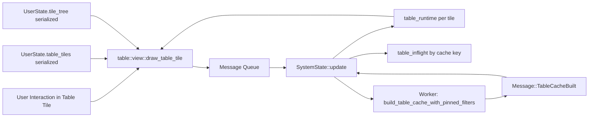
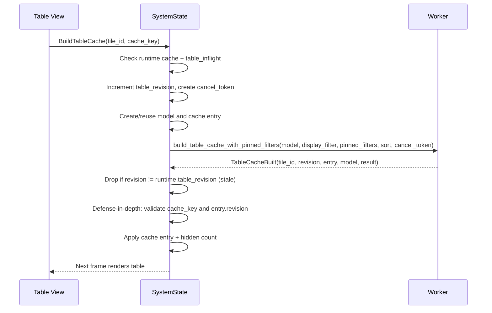
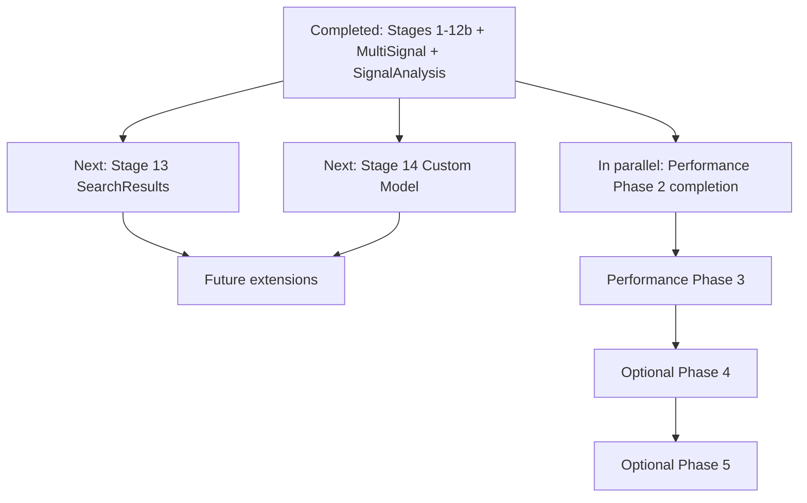

# Table Tile Architecture Specification

## Purpose
This document defines the architecture of Surfer's table tile subsystem. It replaces the earlier design draft with an implementation-grounded specification and integrates the revised performance architecture decisions.

The audience is an engineer implementing or extending table features. After reading this document, an implementer should understand:
- What exists today.
- What is required behavior.
- Where current architecture is intentionally incomplete.
- How to implement the next stages without violating performance and correctness constraints.

## Scope
This specification covers:
- Table tile architecture in `libsurfer/src/table/*`.
- Integration in the central update loop (`libsurfer/src/lib.rs`).
- Tile tree integration (`libsurfer/src/tiles.rs`).
- User entry points (menus, transactions sidebar, command parser, shortcuts).
- Current testing strategy and future staged plans.

This specification does not define:
- New renderer primitives outside existing egui/egui_extras table capabilities.
- Non-table waveform rendering internals.

## User Stories
- Signal change list: show `<time, value>` transitions for a signal, and activating a row moves cursor/time focus.
- Multi-signal change list: show merged transitions across multiple signals with deduplication, and activating a row moves cursor.
- FTR transaction trace: show one transaction per row with timing/type/attribute columns; activating a row focuses that transaction and moves cursor.
- Signal analysis results: show derived metrics (interval durations, per-signal values at sampling edges) computed from waveform data, with configurable sampling signal and mode.
- Signal search results: show one row per source-level match with jump-to-time behavior.
- Virtual data model: generate deterministic synthetic rows/columns for development, benchmarking, and snapshots.
- Future sources: support additional derived table views over waveform/transaction data.

## Requirements
### Functional Requirements
- Table must be a first-class tile pane in the existing tile tree.
- Table tile state must persist in state files as model specification plus view configuration only.
- Runtime cache and runtime interaction state must never be serialized.
- Table rendering must support virtualization and avoid full-list drawing.
- Sorting must support single and multi-column stable ordering.
- Filtering must support Contains, Exact, Regex, and Fuzzy modes.
- Selection must be keyed by stable row identity, not by display index.
- Selection must survive sort/filter changes and support hidden-selection accounting.
- Activation must be model-driven via table actions.
- Cache build must be asynchronous and stale-safe via revision gating and cooperative cancellation.
- In-flight cache requests must be deduplicated for identical cache keys.
- Table actions must flow through existing message/update architecture.
- Table tiles must be removable with runtime cleanup.
- Column identity must be key-based, not index-based.
- Hovering a visible column header must highlight that header cell without changing sort or selection state.
- Table data must be derived from `WaveData` or `TransactionContainer`; table models must not mutate source data.
- Table models must be safe for cross-thread cache building (`Send + Sync` and immutable/read-only semantics).
- Time/value formatting must match Surfer formatting and translation behavior.
- Table interactions must remain keyboard-accessible and compatible with egui/accesskit pathways.
- Scroll behavior must remain predictable after sort, filter, and activation operations.
- Runtime cache/model state must not be captured in undo/redo or serialized state snapshots.
- Table subsystem must degrade safely for missing data, invalid regex, and unavailable models.

### Non-Functional Requirements
- No steady-state per-frame O(n) work on UI thread for large tables.
- No per-frame model reconstruction.
- Async stale results must be dropped deterministically.
- Invalidations must be explicit and testable.
- All behavior changes must be automatically testable (manual-only validation is not acceptable).

## Architecture Overview

## Runtime Layers
### Layer 1: Persistent Tile Configuration
Owned by `UserState`.
- `table_tiles: HashMap<TableTileId, TableTileState>`.
- `TableTileState` contains `TableModelSpec` and `TableViewConfig`.
- Serialized in `.surf.ron` state files.

### Layer 2: Runtime Table State
Owned by `SystemState`.
- `table_runtime: HashMap<TableTileId, TableRuntimeState>`.
- `table_inflight: HashMap<TableCacheKey, Arc<TableCacheEntry>>`.
- Not serialized.

### Layer 3: Model + Cache
Implemented in `libsurfer/src/table/`.
- Model contract: `TableModel` trait.
- Cache build: `build_table_cache` and `build_table_cache_with_pinned_filters`.
- View/controller: `view.rs`.
- Source models: `sources/`.

## Core Domain Model
### Identities
- `TableTileId`: stable per tile in layout/state.
- `TableRowId`: stable row identity within a generation.
- `TableColumnKey`: stable column identity (string or numeric key).
- `TableModelKey`: stable model identity derived from spec and tile id, used in cache keys for async safety.

### Model Specification (`TableModelSpec`)
Current variants and status:

| Variant | Status | Notes |
|---|---|---|
| `SignalChangeList` | Implemented | Supports root or subfield paths. |
| `MultiSignalChangeList` | Implemented | Merged view of multiple signals with deduplication. |
| `TransactionTrace` | Implemented | Per-generator transaction tables. |
| `AnalysisResults` | Implemented | Signal analysis with `SignalAnalysisV1` kind (Stages 1-7). |
| `Virtual` | Implemented | Deterministic synthetic data. |
| `SearchResults` | Planned | Stage 13. Enum variant defined; returns `ModelNotFound` at runtime. |
| `Custom` | Planned | Stage 14. Enum variant defined; returns `ModelNotFound` at runtime. |

### View Configuration (`TableViewConfig`)
- Title.
- Column configs.
- Sort specification.
- Display filter (debounced toolbar clause).
- Pinned filters (persisted always-on clauses).
- Selection mode.
- Dense rows mode.
- Sticky header preference.
- Activate-on-select flag.

### Runtime State (`TableRuntimeState`)
- Current cache key and cache entry.
- Last build error.
- Current selection and hidden selection count.
- Type-to-search state.
- Scroll state and pending scroll operations.
- Debounced filter draft.
- Cached model handle (`Arc<dyn TableModel>`).
- Table revision counter (monotonic `u64`, incremented per `BuildTableCache`).
- Cooperative cancellation token (`Arc<AtomicBool>`).

## Tile Integration
Table is integrated as `SurferPane::Table(TableTileId)`.

Creation flow:
1. Allocate next `TableTileId` from tile tree.
2. Build default view config from model spec and context.
3. Insert into `user.table_tiles`.
4. Insert table pane into tile tree.

Removal flow:
1. Remove table pane from tile tree.
2. Remove persistent tile state from `user.table_tiles`.
3. Remove runtime state from `table_runtime`.

## Async Cache Pipeline

### Current Pipeline Behavior
- View computes `TableCacheKey` from model key, display filter, pinned filters, sort, and waveform generation.
- If cache is stale/missing, view emits `BuildTableCache`.
- `SystemState` deduplicates by `table_inflight` and key match.
- For most model types, model creation happens on UI thread in `BuildTableCache` handling. Signal analysis uses `PreparedSignalAnalysisModelInput` to defer heavy model construction to the worker thread.
- Worker builds filtered/sorted row cache with cooperative cancellation checks via `build_table_cache_with_pinned_filters`.
- Apply step enforces triple validation: revision match, cache key match, and entry revision match.
- Stale and cancelled results are silently discarded.

### Revision Gating
- `runtime.table_revision` is a monotonic `u64` incremented on each `BuildTableCache` request.
- `TableCacheBuilt` handler discards results where `revision != runtime.table_revision`.
- Defense-in-depth: cache key and entry revision are also validated before adoption.

### Cooperative Cancellation
- `runtime.cancel_token` (`Arc<AtomicBool>`) is set to `true` before each new build.
- A fresh token is created and passed to the async cache-build worker.
- The worker checks the token at filter, sort, and build checkpoints.
- Cancelled builds produce `TableCacheError::Cancelled`, which is silently discarded.

### Cache Entry Semantics
- `TableCacheEntry` uses `OnceLock` for one-time cache set.
- New key/generation implies new entry instance.
- Entry tracks key, generation, and revision for stale-safe adoption.

## Filtering, Sorting, and Search
### Display + Pinned Filters
- `display_filter` is a debounced toolbar clause (`FILTER_DEBOUNCE_MS = 200ms`).
- `pinned_filters` is a persisted list of always-on clauses shown as removable chips under the toolbar.
- Each clause supports `Contains`, `Exact`, `Regex`, `Fuzzy`, case sensitivity, and optional `column` targeting (`None` = all columns).
- Effective filtering uses AND semantics across all non-empty pinned clauses plus the non-empty display clause.
- Clauses are normalized through `normalize_search_specs` (drop empty, dedupe, preserve first-seen order).
- Clause targets that reference missing columns are ignored.
- Regex compile errors for active/resolved clauses return structured `TableCacheError::InvalidSearch`.
- `Clear` resets only the toolbar/display clause; pinned clauses remain.
- `Pin` validates regex input, appends a normalized clause set, and applies immediately.

### Sort
- Click header: single-column sort with direction toggle.
- Shift+click header: multi-column sort add/toggle.
- Sort indicator shows direction and multi-sort priority.
- Text sort keys use natural ordering (numeric chunks compare numerically, e.g. `tx#2 < tx#11`).
- Stable ordering fallback uses model base row order.

### Type-to-Search
- Runtime buffer with timeout (1 second).
- Case-insensitive prefix/contains matching over cached or lazily probed search text.
- Wrap-around behavior from current anchor.

## Selection and Activation
### Selection Model
- Selection is runtime-only and row-id based (`BTreeSet<TableRowId>` with optional anchor).
- Supports None, Single, Multi modes.
- Multi mode supports plain click, Ctrl/Cmd toggle, Shift range.
- Hidden selection count is cached in runtime state.

### Keyboard Navigation
- Up/Down, Page Up/Down, Home/End.
- Shift+navigation extends selection range.
- Enter activates anchor row.
- Escape clears selection.
- Ctrl/Cmd+A selects all visible rows in Multi mode.
- Ctrl/Cmd+C copies selection as TSV using current visible column order and cache display row order; Shift modifier includes header row.

### Activation Actions
Model activation maps to:
- Cursor set (`CursorSet(BigInt)`).
- Transaction focus (`FocusTransaction(TransactionRef)`).
- Signal select (`SelectSignal(VariableRef)`, reserved path).
- No-op (`None`).

For transaction rows, activation focuses transaction and sets cursor to transaction start time.

## Column and Layout Behavior
### Implemented
- Uniform row heights with virtualization.
- Dense mode row height variant.
- Header sorting interactions.
- Header hover highlights the hovered header cell and drives tooltip display.
- Column visibility messaging and hidden-column bar.
- Horizontal scrollbar via `egui::ScrollArea::horizontal()` wrapping the table builder.
- Column width persistence through `ResizeTableColumn` message handling.

### Constraints
- `sticky_header` preference is stored but currently not switchable at runtime because the underlying table builder keeps sticky headers.
- Column visibility persistence expects column configs to exist; default empty config means visibility toggles may not affect persisted config until schema-derived column configs are initialized.

### Header Hover Investigation
- Header interactions are handled in `libsurfer/src/table/view.rs::render_table` via per-header cell interaction responses.
- Sort clicks, context menus, and hover tooltips are bound to the full header cell hit area (not only the label text).
- Header hover state (`response.hovered()`) drives header-cell background highlighting.
- Body cells currently paint custom background only for selected rows (`selection_bg`) and otherwise rely on default table striping.
- No hover-related state exists in `TableViewConfig` or `TableRuntimeState`; highlight behavior is runtime-only and frame-local.

## Responsiveness, Accessibility, and Scroll Contract
### Responsiveness
- Rendering uses row virtualization and avoids full dataset drawing.
- Cell values are probed lazily per visible row during the egui row callback (no batch pre-materialization).
- Cache build executes off-thread. Signal analysis defers model construction to the worker via `PreparedSignalAnalysisModelInput`. Other model types are constructed on the UI thread before spawning the worker.

### Accessibility
- Rows are selectable and keyboard navigable through table focus handling.
- Table interactions use egui widgets and remain compatible with accesskit-enabled builds.

### Scroll Contract
- After sort changes, scroll targets prioritize selected-row visibility when possible.
- After filter changes, scroll targets prefer selected-row visibility and otherwise recover to valid visible regions.
- After activation, scroll behavior ensures activated row visibility.

## Model Implementations
### Virtual Model
- Deterministic synthetic dataset.
- Used for infrastructure tests, snapshots, and performance experiments.

### SignalChangeList Model
- Data source: loaded waveform signal transitions.
- Columns: Time, Value.
- Row id strategy: timestamp-based id, with hashed sequence fallback for duplicate timestamps.
- Formatting: uses Surfer time formatter and translator pipeline.
- Activation: set cursor to selected transition time.

### MultiSignalChangeList Model
- Data source: loaded waveform signal transitions for multiple signals.
- Columns: Time, Signal, Value (plus per-signal columns for multi-signal views).
- Deduplication via `MultiSignalIndex` helper for merged timestamp ordering.
- Formatting: uses Surfer time formatter and translator pipeline.
- Activation: set cursor to selected transition time.

### TransactionTrace Model
- Data source: transactions for one generator.
- Columns: fixed timing/type columns plus dynamic attribute columns.
- Row ordering: start-time order.
- Row id: transaction id within generator scope.
- Activation: focus transaction and set cursor to transaction start.
- FTR lazy-load interaction: generator transaction data must be loaded before model use.

### SignalAnalysis Model
- Data source: waveform transitions for configurable set of signals, sampled at edges of a configurable sampling signal.
- Columns: Interval (start-end time range), Duration, plus one column per analyzed signal showing value at sampling edge.
- Sampling modes: `Event`, `PosEdge`, `AnyChange` (auto-inferred from sampling signal metadata via `infer_sampling_mode`).
- Row id: interval index.
- Configuration: `SignalAnalysisConfig` with `sampling` (signal reference), `signals` (list of variable + field + translator), and `run_revision` (for deterministic refresh).
- Model construction deferred to worker thread via `PreparedSignalAnalysisModelInput`.
- UX entry points: wizard dialog (`OpenSignalAnalysisWizard`), refresh (`RefreshSignalAnalysis`), edit (`EditSignalAnalysis`).
- Activation: set cursor to interval start time.

## TableModel Trait
The `TableModel` trait (`Send + Sync`) defines the contract for all model implementations:
- `schema()` - returns `TableSchema` with column definitions.
- `row_count()` - total row count.
- `row_id_at(index)` - row id by base order index.
- `search_text_mode()` - returns `Eager` (build search text during cache build) or `LazyProbe` (probe on demand).
- `materialize_window(row_ids, visible_cols, purpose)` - batch probe for cells, sort keys, or search text by `MaterializePurpose`.
- `cell(row, col)` - single cell value (`TableCell::Text` or `TableCell::RichText`).
- `sort_key(row, col)` - sortable value (`Numeric`, `Text`, `Bytes`, or `None`).
- `search_text(row)` - concatenated searchable text for a row.
- `on_activate(row)` - returns `TableAction` for row activation.

## Entry Points and UX Integration
### Menus
- Variable context menu supports opening signal change list table.
- Variable context menu supports opening multi-signal change list table.
- Variable context menu supports opening signal analysis wizard.
- Stream/generator context menus support opening transaction table(s).
- Stream-level transaction action opens one table per generator.

### Transactions Sidebar
- Generator context menu supports opening one transaction table.
- Stream context menu supports opening transaction tables for all generators.

### Commands
- `table_view` opens signal change list for focused or explicit variable.
- `transaction_table` opens transaction table for currently focused transaction's generator.

### Keyboard Shortcuts
- Shortcut action exists for table view (`OpenSignalChangeList`).
- Default config maps `table_view` to `L`.
- No dedicated shortcut action exists for `transaction_table`; transaction table access is currently command/menu-driven.

## Persistence, Reload, and Invalidation
### Persisted
- Tile tree layout.
- Table tile specs and view config.

### Runtime-only
- Cache entries.
- Selection.
- Scroll state.
- Filter draft.
- Last errors.
- Cached model handle.
- Table revision counter.
- Cancellation token.

### Current Invalidation Rules
- Cache rebuild when cache key changes.
- Cache key includes model key, generation, display filter, pinned filters, and sort.
- Model key for signal analysis includes `run_revision` for deterministic refresh rebuilds.
- Selection/model clear when detected generation change in view runtime state.
- Hidden selection count recomputed on selection/cache application.
- Stale results dropped by revision gating (primary) and cache key match (defense-in-depth).

### Current Risk Area
- Model/context revisions not yet explicit for all context changes. Time formatting or translator changes can invalidate semantic model output without changing the current table cache key, so stale table renderings are possible until another invalidation event occurs.

## Performance Architecture Decisions
| Decision | Target | Current Status |
|---|---|---|
| Separate model lifecycle from view-cache lifecycle | Keep model and cache lifetimes explicit and independent | Implemented. Runtime model cache (`runtime.model`) exists. Model key is explicit in `TableCacheKey`. |
| Explicit revision keys | Add model build key with context revision | Partially implemented. `TableModelKey` is in cache key. Signal analysis includes `run_revision`. General context revision (time format, translators) not yet tracked. |
| Async stale-safe pipeline | Apply worker results only on key match | Implemented. Triple validation: revision gate, cache key match, entry revision match. |
| Cooperative cancellation | Cancel in-flight builds when new build requested | Implemented. `cancel_token` (`Arc<AtomicBool>`) checked at filter/sort/build checkpoints. |
| Eliminate steady-state cloning | Borrow hot-path data and avoid full-vector clones | Implemented for row/id navigation/filter paths. View uses `&cache.row_ids` references. |
| Lazy cell access | Avoid batch pre-materialization for render path | Implemented. Cells probed on-demand per visible row in egui row callback. |
| Prioritize low-risk wins first | Land no-regret perf fixes before deep refactor | Implemented. Row index, hidden-count caching, temporary sort-key handling, and model caching are in place. |

## Target Performance Architecture
### Target Keys
- Model build key must include waveform generation and table-context revision.
- Cache key remains view-specific and must be tied to model key that produced it.

### Target Invalidation Rules
1. Rebuild model + cache when model key changes.
2. Rebuild cache only when sort/filter changes and model key is unchanged.
3. Recompute hidden selection count only when selection or visible row set changes.
4. Always drop stale worker results by strict key checks.

### Context Revision Inputs (Required)
- Time unit/time string format changes.
- Translator set changes.
- Display-format changes affecting model output.

## Known Gaps and Technical Debt
- Model construction for most model types (except signal analysis) still runs on UI thread before spawning worker.
- General context revision (time format, translators) is not yet tracked in cache keys.
- `SearchResults` and `Custom` model variants are defined but not implemented (return `ModelNotFound`).
- Source-level search (`source_query`) is designed but not implemented yet.
- Sticky header option is stored but currently non-functional as a toggle.
- Column config initialization from schema defaults is incomplete for some runtime visibility workflows.

## Testing Strategy
### Principle
All table functionality must be verified by automated tests.

### Current Test Portfolio
- Unit tests for model contracts, selection mechanics, sort/filter helpers, navigation helpers, and cache behavior.
- Unit tests for enhanced filtering semantics cover column-targeted clauses, multi-clause AND behavior, missing-column handling, regex error behavior, duplicate-clause normalization, and eager-search text population under column-only filters.
- Message-flow integration tests for tile lifecycle, selection, activation, copy, sort/filter updates, pinned-filter reducer behavior, and stream-level transaction table opening.
- Snapshot tests for visual behavior, multi-tile layouts, sorting, keyboard-selection states, transaction table rendering/restoration, multi-signal change lists, signal analysis results, two pinned filter chips, and pinned filter restoration from `.surf.ron` after waveform reload.
- Safety tests for performance-sensitive invariants (row-index consistency and hidden-count correctness).
- Revision gating tests for stale cache result handling.

### Ongoing Test Requirements
- Add stale-result race tests whenever async key logic changes.
- Add large-table ignored perf regression tests for interaction paths.
- Preserve snapshot parity unless behavior is intentionally changed.

## Implementation Status
### Completed Stages
- Stages 1-11: core table infrastructure, virtual model, signal change list model, sort/filter/selection/navigation/copy foundations, scroll and visibility primitives.
- Stage 12: transaction trace model and integration.
- Stage 12b: stream-level transaction table opening (one table per generator).
- Multi-signal change list model (merged view of multiple signals).
- Signal analysis model (Stages 1-7): typed config, async model build with deferred construction, wizard UI, context menu entry, refresh/edit with revisioned rebuilds, horizontal scrollbar.
- Enhanced display filtering: column-targeted search clauses, pinned filters, cache-key integration, reducer support, and snapshot coverage.
- Header-cell hover highlighting with automated color-blend coverage.

### Current Availability Matrix
| Capability | Status |
|---|---|
| Virtual table model | Complete |
| Signal change list table | Complete |
| Multi-signal change list table | Complete |
| Transaction trace table | Complete |
| Stream-level transaction table opening | Complete |
| Signal analysis results table | Complete |
| Revision gating and cooperative cancellation | Complete |
| Horizontal scrollbar | Complete |
| Column-targeted display filter clauses | Complete |
| Pinned display filters | Complete |
| Header-cell hover highlighting | Complete |
| Source-level search results model | Pending |
| Custom/plugin model registry | Pending |

## Future Plans

### Stage 13: SearchResults Model
### Goal
Implement source-level search that produces a derived table model.

### Scope
- New `SearchResults` model implementation.
- Source query execution over waveform data.
- Schema with signal/time/value/context fields.
- Activation behavior to jump and highlight.
- Progress and cancellation behavior for long searches.

### Acceptance Criteria
- Automated tests validate occurrence correctness.
- Automated tests validate context/metadata columns.
- Integration tests validate navigation/highlight actions.
- Long-running search behavior is testable and cancel-safe.

### Stage 14: Custom Model Support
### Goal
Support externally registered table models via a model registry.

### Scope
- Registry for model factories keyed by identifier.
- `Custom` model spec resolution and error reporting.
- Documentation for plugin/external model integration.

### Acceptance Criteria
- Factory registration tests.
- Unknown key error-path tests.
- Integration test for rendering a custom model in a tile.

## Remaining Performance Phases
### Phase 2 Completion
- Introduce general context revision source (time format, translators) and integrate with cache key invalidation.
- Move remaining UI-thread model construction to workers where feasible.

### Phase 3
- Move heavy model construction to workers via owned build inputs (partially done for signal analysis).
- Keep cheap UI-thread request path for simple models.

### Phase 4
- Optional search memory/performance tuning after measurement.

### Phase 5
- Optional advanced selection semantics only if profiling justifies complexity.

## Implementation Order Summary

## Definition of Done for Next Architecture Milestone
- No steady-state model recreation during table interaction paths.
- General context revision integrated with stale-safe async apply for time format/translator changes.
- Cache/model invalidation rules are documented and covered by tests.
- SearchResults stage is implemented with automated tests.
- Existing table visual snapshots remain stable unless intentionally updated.
